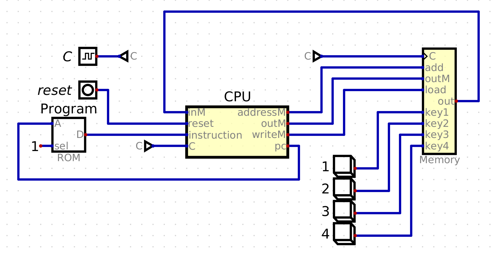

Unidad 1. Arquitectura del computador
=======================================

Introducción
--------------

En esta unidad vas a aprender los bloques de construcción básicos del hardware de un sistema de cómputo 
moderno, cómo esos bloques pueden combinarse para construir computadores y cómo hacen para ejecutar 
programas.

Propósito de aprendizaje
****************************

Comprender cómo funciona el hardware de un computador moderno desde una perspectiva sistémica, es decir, 
estudiando las partes que lo componen y cómo se conectan para conseguir funciones más complejas.

Te acercarás al lenguaje de programación ensamblador y verás la relación de este con el lenguaje C.

Temas
********

* Organización básica de un computador digital moderno.
* Lenguaje de máquina-lenguaje ensamblador-lenguaje C

Trayecto de actividades
------------------------

Estos ejercicios te servirán para preparar la evaluación de esta unidad. Realiza 
cada uno con detenimiento y consciencia. No dejes de preguntar si tienes 
dudas.

Ejercicios
***********

Ejercicio 1: Demo 
^^^^^^^^^^^^^^^^^^^^

Verifica si en un tu sistema tienes la aplicación Digital (escribe Digital en el lanzador de 
aplicaciones). Si no la tienes la puedes descargar `aquí <https://github.com/juanferfranco/SistemasComputacionales/tree/main/docs/_static/Digital.zip>`__

Si tuviste que descargar la aplicación, la puedes descomprimir en el directorio ``apps``. Luego 
abre el directorio en la terminal (click derecho, open in terminal). Ejecuta el archivo 
install.sh. Abre la aplicación.

Ve a la opción Edit/Settings/Advanced y en Java library adiciona 
esta biblioteca que está en ``Digital/custom/digitaln2t-1.0-SNAPSHOT.jar``.

Ahora abre el archivo demo que está en ``Digital/custom/project05/ComputerFull4Key.dig``.

Debes ver algo así:

|

Por ahora nota que hay tres bloques de interés: uno que dice ROM (Program), CPU y 
Memory. Dale click derecho al bloque que dice ROM, selecciona Advance y en la opción 
File carga el archivo ``Digital/custom/project05/fill.hex``. Las primeras líneas 
del archivo fill.hex se ven así::

  :020000000040BE
  :0200020010EC00
  :020004001000EA
  :0200060008E30D
  :02000800006096
  :02000A0010FCE8
  :02000C001300DF
  :02000E0005E308 

En esas líneas están almacenados los códigos de máquina de las instrucciones que 
ejecutará la CPU.

En este punto ya tienes configurado el DEMO. Se trata de un computador de 16 bits 
que ejecutará un programa almacenado en la memoria ROM. Para ejecutar el programa 
selecciona ``Simulation/Start of Simulation``. Nota el ícono de este comando. 
Puedes iniciar la simulación usando el botón marcado con el mismo ícono. Al iniciar 
la simulación se activa el botón que la detiene (botón con 
el cuadrado de color rojo).

Un vez inicie la simulación presiona con el mouse una de las teclas mercadas con los 
números 1, 2, 3 o 4. Se activará una ventana titulada HACK Display. Esta ventana 
simula una pantalla de 512 pixels de ancho por 256 pixels de alto. Mueve la ventana 
hacia la izquierda en caso de que te impida el acceso a las teclas. Deja presionada 
cualquiera de las teclas. Verás que los pixels del Hack Display se encenderán de color 
negro. Si dejas de presionar la tecla los pixels cambiarán a blanco.

.. tip:: CON ESTE COMPUTADOR PODEMOS HACER JUEGOS

  El computador que acabas de simular tiene todos los elementos para ejecutar 
  juegos. Tiene una memoria (ROM) para almacenar las instrucciones y datos iniciales del juego. 
  Tiene un circuito para ejecutar las instrucciones (CPU). Tiene una memoria para ir 
  almacenando cómo va cambiando el juego. Tiene teclado y pantalla (Memory).

Si ya terminaste de experimentar, cierra la ventana HACK Display y termina la simulación.

..
  Lee el `capítulo 4 del libro guía <https://b1391bd6-da3d-477d-8c01-38cdf774495a.filesusr.com/ugd/44046b_7ef1c00a714c46768f08c459a6cab45a.pdf>`__.

  Responde las siguientes preguntas:

  #. Muestra una instrucción tipo A en representación simbólica y en lenguaje de máquina. Explica qué hace esta instrucción.
  #. Muestra una instrucción tipo C en representación simbólica y en lenguaje de máquina. Explica qué hace esta instrucción.
  #. En el lenguaje hack ¿Qué son los símbolos? muestra varios ejemplos de estos.
  #. ¿Qué son los labels? ¿Para qué sirven? ¿En que se diferencian de los símbolos?

  Sesión 4
  **********
  (Tiempo estimado: 1 hora 40 minutos)

  Ejercicio 6: introducción al lenguaje ensamblador
  ^^^^^^^^^^^^^^^^^^^^^^^^^^^^^^^^^^^^^^^^^^^^^^^^^^^^^^

  Realiza el proyecto 4 que encuentras `aquí <https://www.nand2tetris.org/project04>`__

  Antes de comenzar a programar realiza un diagrama de flujo que indique cómo solucionarás el 
  problema.

  .. warning::
      CONTROL DE VERSIÓN

      Desde el inicio del proyecto debes crear un repositorio y realizar commits periódicamente. Tu repositorio 
      debe mostrar el proceso de trabajo.

  Trabajo autónomo 4
  ********************
  (Tiempo estimado: 1 hora 20 minutos)

  Terminar el proyecto 4.

  Sesión 5
  **********
  (Tiempo estimado: 1 hora 40 minutos)

  Ejercicio 7: de ensamblador a alto nivel 
  ^^^^^^^^^^^^^^^^^^^^^^^^^^^^^^^^^^^^^^^^^^

  En esta sesión analizaremos el siguiente programa:

  .. image:: ../_static/asmProg.png
    :alt: programa en ensamblador

  Responderemos las siguientes preguntas:

  * ¿Qué hace el programa?
  * ¿Cómo funciona?
  * ¿Cómo quedaría una posible traducción a lenguaje de alto nivel?

  .. warning:: ALERTA DE SPOILER

      Te mostraré dos posible respuestas a la última pregunta usando 
      como lenguaje de alto nivel C. Ten presente que en este caso R0 
      es la representación simbólica de la dirección 0, i es la dirección 
      16 y j es la dirección 17.

  Traducción 1:

  .. code:: c 

      int R0 =10;
      int i;
      int *j;

      if(R0 >0){
          i = R0;
          j = 16384;

          while(i > 0){
          // "RAM[j]" = -1;
          *j = -1;
              j = j + 32;
              i = i - 1;
          }
      }
      AQUI:
      goto AQUI;
              
  Traducción 2:

  .. code:: c 

      int R0 =10;
      int *j = 16384;

      if(R0 >0){
          for(int i = R0; i > 0;  i--){
          *j = -1;
              j = j + 32;
          }
      }
      while(1);

  Trabajo autónomo 5
  ********************
  (Tiempo estimado: 1 hora 20 minutos)

  Revisar la unidad hasta este punto y terminar los ejercicios pendientes.

  Sesión 6
  **********
  (Tiempo estimado: 1 hora 40 minutos)

  Ejercicio 8: implementación de una CPU
  ^^^^^^^^^^^^^^^^^^^^^^^^^^^^^^^^^^^^^^^^

  En esta sesión vamos a analizar partes de la implementación del computador 
  que realiza el set de instrucciones del lenguaje ensamblador estudiado 
  previamente.

  La herramienta que usaremos se llama Digital y se puede descargar 
  `aquí <https://github.com/hneemann/Digital>`__.

  El circuito que usaremos en clase se llama CPUplusMemDisplay.dig y se puede 
  descargar (entre otros circuitos) 
  `aquí <https://github.com/juanferfranco/SistemasComputacionales/tree/main/DigitalProjects/custom/project05>`__.

  En la parte final de esta sesión veremos que el computador estudiado se puede 
  llevar a una implementación física como se muestra en 
  `este proyecto <https://gitlab.com/x653/nand2tetris-fpga/>`__. En particular 
  puedes ver en 
  `este video <https://gitlab.com/x653/nand2tetris-fpga/-/raw/master/08_Hack8-Sound/jack/Tetris/tetris.mp4>`__ 
  una aplicación interactiva funcionando. 

  Alguna vez te has preguntado ¿Cómo se implementa y construye un chip? Pues se 
  parte de un diseño que se describe mediante algún lenguaje de descripción 
  de hardware, como por ejemplo, el que puedes observar en la imagen:

  .. image:: ../_static/gateHDL.png

  Luego este diseño debe descomponerse en partes más simples. Esas partes se 
  denominan `transistores <https://en.wikipedia.org/wiki/Transistor>`__:

  .. image:: ../_static/transistor.png

  Finalmente, los transistores y sus conexiones se deben transferir
  a un medio físico. Esto se hace mediante un proceso conocido como
  fotolitografía:

  .. raw:: html

      

          <iframe width="560" height="315" src="https://www.youtube.com/embed/vK-geBYygXo" frameborder="0" allow="accelerometer; autoplay; encrypted-media; gyroscope; picture-in-picture" allowfullscreen></iframe>
      

  .. note:: 
      Material complementario 

      ¿Cómo funciona un transistor? 

  .. raw:: html
      
      

          <iframe width="560" height="315" src="https://www.youtube.com/embed/tz62t-q_KEc" frameborder="0" allow="accelerometer; autoplay; encrypted-media; gyroscope; picture-in-picture" allowfullscreen></iframe>
      

  Trabajo autónomo 6
  ********************
  (Tiempo estimado: 1 hora 20 minutos)

  Analiza de nuevo el programa que estudiamos juntos en la sesión 5.

  Evaluación de la unidad
  -------------------------

  Problema
  ***********

  El problema está divido en dos challenges. Tu programa debe cumplir exitosamente ambos challenges.

  * Challenge 1: ``leer indefinidamente el teclado`` y llenar la pantalla de negro si la tecla leída es 
    la letra F.
  * Challenge 2: ``leer indefinidamente el teclado`` y llenar la pantalla de negro si la tecla leída es 
    la letra ``F`` y limpiar la pantalla si la letra leída es la ``C``. 

  Sustentación 
  **************

  Para sustentar tu evaluación realizarás en el repositorio la Wiki (como aprendiste en el ejercicio 
  20 de la introducción a Git y GitHub). 

  * Tu sustentación debe tener la representación en lenguaje de alto  del programa que realizaste 
    en ensamblador (50% del valor total de la sustentación).
  * Debes mostrar cada instrucción de alto a nivel a qué instrucciones de bajo nivel corresponde 
    (50% del valor total de la sustentación).

  Consideraciones
  *****************

  * Para solucionar la evaluación debes utilizar Git y GitHub. 
    `Aquí <https://classroom.github.com/a/U7e2yEIR>`__ está el enlace de la evaluación así como lo 
    practicaste en el ejercicio 19 de la guía de introducción a Git y GitHub.
  * Debes realizar constantemente commit y push al repositorio en GitHub. Debe verse claramente la 
    evolución de tu evaluación en el tiempo.
  * No olvides colocar la información solicitada en la parte superior de ``program.asm``.

  Para realizar la evaluación: 

  * CLONA el repositorio.
  * Cámbiate al directorio problem.
  * edita ÚNICAMENTE el archivo program.asm.
  * No olvides hacer commits y push.
  * Puedes hacer las pruebas usando la herramienta CPUEmulator.sh o CPUEmulator.bat dependiendo de tu 
    sistema operativo.
  * Al hacer las pruebas te recomiendo colocar la animación en FAST y con la opción No Animation. No 
    olvides que debes dar click en el botón del teclado para que el programa reciba las teclas que 
    presionarás.
  * También puedes hacer pruebas automáticas. En este caso usarás la línea de comandos. Cámbiate al 
    directorio problem y luego ejecuta:

    Para el challenge 1:

    .. code-block:: bash 

        ../tools/CPUEmulator.sh programBasic.tst
      
    Para el challenge 2:
    .. code-block:: bash 

        ../tools/CPUEmulator.sh program.tst

    Si tienes éxito verás el mensaje ``End of script - Comparison ended successfully``. De lo contrario 
    te aparecerá un mensaje que indicará la línea del archivo ``.out`` que no coincide con el vector de prueba 
    en el archivo ``.cmp``.

  * Ten en cuanta que cada que hagas ``push`` al repositorio remoto, las pruebas anteriores se ejecutarán 
    automáticamente y podrás ver el resultado.

  Criterios de evaluación
  ************************

  * Challenge 1: 1 unidad.
  * Challenge 2: 2 unidades.
  * Solo sustentación del challenge 1: 1 unidad.
  * Sustentación del challenge 2 (esta incluye el challenge 1): 2 unidades.

  Retroalimentación de la evaluación
  ------------------------------------

  En `este <https://github.com/juanferfranco/scu1-e1-2022-10-feedback.git>`__ enlace podrás consultar 
  y clonar el repositorio con una posible solución a la evaluación.