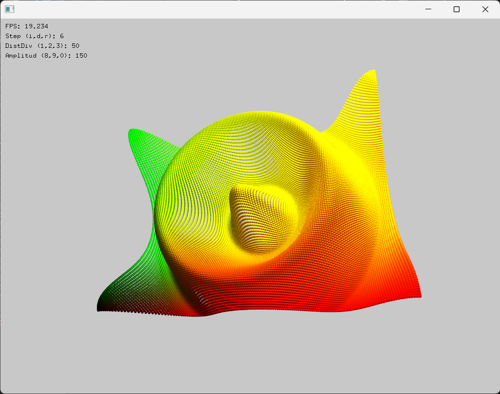

Experiencia de aprendizaje 3. Lenguaje de alto nivel 
===========================================================

Introducción
--------------

En esta unidad retomarás algunos conceptos de programación en alto nivel y 
analizarás cómo están implementados. 

Investigación 
---------------

Actividad 1
*************

Esta actividad será grupal y demostrativa. Te mostraré los pasos a seguir 
para instalar y probar la herramienta que usarás desde ahora en el curso. Se trata 
de `openframeworks <https://openframeworks.cc/>`__. El objetivo en este curso 
no es que aprendas a programar en openframeworks, sino que entiendas cómo se 
implementan algunos conceptos de programación en alto nivel, pero usando un 
framework de programación creativa en C++ que te permitan explorar y experimentar 
de manera más visual y creativa.

Para verificar que todo quedó correctamente instalado, vamos a realizar un pequeño 
ejercicio modificando ligeramente el archivo ofApp.cpp que se genera por defecto:

.. code-block:: c++

    #include "ofApp.h"

    //--------------------------------------------------------------
    void ofApp::setup(){
        ofBackground(0);
    }

    //--------------------------------------------------------------
    void ofApp::update(){

    }

    //--------------------------------------------------------------
    void ofApp::draw(){
        ofSetColor(255);
        ofDrawCircle(ofGetMouseX(), ofGetMouseY(), 20);
    }

* ¿Cuál es el resultado que se obtiene al ejecutar este programa?

Actividad 2 
*************

De nuevo una actividad grupal en la cual escribiremos juntos nuestra primera aplicación 
y analizaremos las diferentes partes que la componen.

* Genera un proyecto con el generador de proyectos de openframeworks.
* Abre el proyecto en Visual Studio.
* Modifica el archivo ofApp.h así:

.. code-block:: c++

    #pragma once

    #include "ofMain.h"

    class ofApp : public ofBaseApp{

        public:
            void setup();
            void update();
            void draw();

            void mouseMoved(int x, int y );
            void mousePressed(int x, int y, int button);

        private:

            vector<ofVec2f> particles;
            ofColor particleColor;
            
    };

* Ahora modifica el archivo ofApp.cpp así:

.. code-block:: c++

    #include "ofApp.h"

    //--------------------------------------------------------------
    void ofApp::setup(){
        ofBackground(0);
        particleColor = ofColor::white;
    }

    //--------------------------------------------------------------
    void ofApp::update(){

    }

    //--------------------------------------------------------------
    void ofApp::draw(){
        for(auto &pos: particles){
            ofSetColor(particleColor);
            ofDrawCircle(pos.x, pos.y, 50);
        }
    }

    //--------------------------------------------------------------
    void ofApp::mouseMoved(int x, int y ){
        particles.push_back(ofVec2f(x, y));
        if (particles.size() > 100) {
            particles.erase(particles.begin());
        }
    }

    //--------------------------------------------------------------
    void ofApp::mousePressed(int x, int y, int button){
        particleColor = ofColor(ofRandom(255), ofRandom(255), ofRandom(255));
    }

Analicemos juntos este código:

* ¿Qué fue lo que incluimos en el archivo .h?
* ¿Cómo funciona la aplicación?
* ¿Qué hace la función mouseMoved?
* ¿Qué hace la función mousePressed?
* ¿Qué hace la función setup?
* ¿Qué hace la función update?
* ¿Qué hace la función draw?
  
Actividad 3
*************

Analiza la aplicación anterior. ¿Qué hace cada función? ¿Qué hace cada línea de código?

Realiza un experimento con la aplicación anterior. Modifica alguna parte de su código.

Actividad 4
***************

Esta actividad la puedes realizar en tu tiempo de trabajo independiente de la semana de investigación. 
Invierte el espacio completo de 1 hora 40 minutos, pero si realmente piensas que quieres 
explorar más sobre programación en C++, entonces invierte más tiempo.

Ten presente que este recurso que te propongo se ajusta a la metodología que estamos siguiendo 
que es aprender a aprender mediante la investigación y la experimentación. Notarás entonces 
que en los videos hay muchos experimentos que podrás reproducir y analizar, pero ten presente 
que el autor usa Linux y tu usarás, normalmente, Windows.

Te voy a proponer varios videos que te ayudarán a introducirte en la programación con C++. 
Mira, en este curso no buscamos que aprendas C++, pero sí que entiendas cómo se implementan 
algunos conceptos de programación en alto nivel. Por tanto, usaremos lo necesario de C++ 
para lograr este objetivo.

Analiza algunos videos del playlist de Mike Shah 
`The C++ Programming Language <https://youtube.com/playlist?list=PLvv0ScY6vfd8j-tlhYVPYgiIyXduu6m-L&si=ISrbMNVl2z6Qf-yO>`__

Actividad 5
*************

En la unidad anterior introducimos el concepto de puntero. Ahora vamos a profundizar en este 
concepto de manera práctica.

El siguiente ejemplo se supone (en la actividad que sigue vas a corregir un error) que te permite 
seleccionar una espera y moverla con el mouse.

Modifica el archivo ofApp.h de la siguiente manera:

.. code-block:: c++

    #pragma once

    #include "ofMain.h"

    class Sphere {
    public:
        Sphere(float x, float y, float radius);
        void draw();
        void update(float x, float y);
        float getX();
        float getY();
        float getRadius();

    private:
        float x, y; 
        float radius; 
        ofColor color; 
    };

    class ofApp : public ofBaseApp{

        public:
            void setup();
            void update();
            void draw();

            void mouseMoved(int x, int y );
            void mousePressed(int x, int y, int button);

        private:
            
            vector<Sphere*> spheres;
            Sphere* selectedSphere;
    };

Y el archivo ofApp.cpp así:

.. code-block:: c++

    #include "ofApp.h"

    Sphere::Sphere(float x, float y, float radius) : x(x), y(y), radius(radius) {
        color = ofColor(ofRandom(255), ofRandom(255), ofRandom(255)); 
    }

    void Sphere::draw() {
        ofSetColor(color);
        ofDrawCircle(x, y, radius);
    }

    void Sphere::update(float x, float y) {
        this->x = x;
        this->y = y;
    }

    float Sphere::getRadius() {
        return radius;
    }

    float Sphere::getX() {
        return x;
    }

    float Sphere::getY() {
        return y;
    }

    //--------------------------------------------------------------
    void ofApp::setup(){
        ofBackground(0);

        for (int i = 0; i < 5; i++) {
            float x = ofRandomWidth();
            float y = ofRandomHeight();
            float radius = ofRandom(20, 50);
            spheres.push_back(new Sphere(x, y, radius));
        }
        selectedSphere = nullptr;

    }

    //--------------------------------------------------------------
    void ofApp::update(){
        if (selectedSphere != nullptr) {
            selectedSphere->update(ofGetMouseX(), ofGetMouseY());
        }
    }

    //--------------------------------------------------------------
    void ofApp::draw(){
        for (auto sphere : spheres) {
            sphere->draw();
        }
    }

    //--------------------------------------------------------------
    void ofApp::mouseMoved(int x, int y ){

    }

    //--------------------------------------------------------------
    void ofApp::mousePressed(int x, int y, int button){

        if(button == OF_MOUSE_BUTTON_LEFT){
            for (auto sphere : spheres) {
                float distance = ofDist(x, y, sphere->getX(), sphere->getY());
                if (distance < sphere->getRadius()) {

                    selectedSphere = sphere;
                    break;
                }
            }
        }
    }

* ¿Cuál es la definición de un puntero?
* ¿Dónde está el puntero?
* ¿Cómo se inicializa el puntero?
* ¿Para qué se está usando el puntero?
* ¿Qué es exactamente lo que está almacenado en el puntero?

Actividad 6
*************

El código anterior tiene un problema. ¿Puedes identificar cuál es? ¿Cómo lo solucionarías?
Recuerda que deberías poder seleccionar una esfera y moverla con el mouse.

Actividad 7
*************

Ahora te voy a proponer que reflexiones profundamente sobre el manejo de la memoria en un programa.
Se trata de un experimento en el que tienes que analizar por qué está funcionando mal.

Modifica el archivo ofApp.h de la siguiente manera:

.. code-block:: c++

    #pragma once

    #include "ofMain.h"

    class Sphere {
    public:
        Sphere(float x, float y, float radius);
        void draw() const;

        float x, y; 
        float radius; 
        ofColor color; 
    };

    class ofApp : public ofBaseApp {
    public:
        void setup();
        void update();
        void draw();
        
        void keyPressed(int key);

    private:
        std::vector<Sphere*> globalVector; 
        void createObjectInStack(); 
    };

Y el archivo ofApp.cpp así:

.. code-block:: c++

    #include "ofApp.h"

    Sphere::Sphere(float x, float y, float radius) : x(x), y(y), radius(radius) {
        color = ofColor(ofRandom(255), ofRandom(255), ofRandom(255));
    }

    void Sphere::draw() const {
        ofSetColor(color);
        ofDrawCircle(x, y, radius); 
    }

    void ofApp::setup() {
        ofBackground(0);
    }

    void ofApp::update() {
    }

    void ofApp::draw() {
        ofSetColor(255);
        for (Sphere* sphere : globalVector) {
            if (sphere != nullptr) {
                ofDrawBitmapString("Objects pointed: " + ofToString(globalVector.size()), 20, 20);
                ofDrawBitmapString("Attempting to draw stored object...", 20, 40);
                ofDrawBitmapString("Stored Object Position: " + ofToString(sphere->x) + ", " + ofToString(sphere->y), 20, 60);
                sphere->draw();
            }
        }
    }

    void ofApp::keyPressed(int key) {
        if (key == 'c') {
            if (globalVector.empty()) {
                createObjectInStack();
            }
        }
        else if (key == 'd') {
            if (!globalVector.empty()) {
                ofLog() << "Accessing object in global vector: Position (" << globalVector[0]->x << ", " << globalVector[0]->y << ")";
            }
            else {
                ofLog() << "No objects in the global vector.";
            }
        }
    }

    void ofApp::createObjectInStack() {
        Sphere localSphere(ofRandomWidth(), ofRandomHeight(), 30); 
        globalVector.push_back(&localSphere);
        ofLog() << "Object created in stack: Position (" << localSphere.x << ", " << localSphere.y << ")";
        localSphere.draw();
    } 

* ¿Qué sucede cuando presionas la tecla 'c'?

Realiza esta modificación a la función createObjectInStack donde claramente se está creando un objeto, pero 
se está creando en el heap y no en el stack, así que no te dejes confundir por el nombre de la función. 

.. code-block:: c++ 

    void ofApp::createObjectInStack() {
        // Sphere localSphere(ofRandomWidth(), ofRandomHeight(), 30); 
        // globalVector.push_back(&localSphere);
        // ofLog() << "Object created in stack: Position (" << localSphere.x << ", " << localSphere.y << ")";
        // localSphere.draw();
        Sphere* heapSphere = new Sphere(ofRandomWidth(), ofRandomHeight(), 30);
        globalVector.push_back(heapSphere);
        ofLog() << "Object created in heap: Position (" << heapSphere->x << ", " << heapSphere->y << ")";
        heapSphere->draw();
    } 

* ¿Qué sucede cuando presionas la tecla 'c'?
* ¿Por qué ocurre esto?

Actividad 8
*************

Construye un experimento (un programa) en el que puedas crear y dibujar objetos que se almancenan:

* En el heap.
* En el stack.
* En memoria global.

.. note:: si puedes usar el stack

    Pero recuerda que los objetos solo dudarán en el stack el tiempo que dure la función que los creó. 
    ¿Hay alguna función en el programa que dure durante toda la ejecución del programa? 

* ¿Cuándo debo crear objetos en el heap y cuándo en memoria global?

Actividad 9
*************

Considera el siguiente código. El archivo ofApp.h es el siguiente:

.. code-block:: c++

    #pragma once

    #include "ofMain.h"

    class ofApp : public ofBaseApp{
    public:
        void setup();
        void update();
        void draw();
        
        void keyPressed(int key);
        void mousePressed(int x, int y, int button);

    private:
        vector<ofVec2f*> heapObjects;
    };

Y el archivo ofApp.cpp es el siguiente:

.. code-block:: c++

    #include "ofApp.h"

    void ofApp::setup(){
        ofBackground(0);
    }

    void ofApp::update(){
    }

    void ofApp::draw(){
        ofSetColor(0, 0, 255); // Color azul para los objetos del heap
        for(auto& pos : heapObjects) {
            ofDrawCircle(pos->x, pos->y, 20);
            ofDrawBitmapString("Heap Memory", pos->x - 40, pos->y - 40);
        }
    }

    void ofApp::keyPressed(int key){
        if(key == 'f') {
            if(!heapObjects.empty()) {
                delete heapObjects.back(); 
                heapObjects.pop_back(); 
            }
        }
    }

    void ofApp::mousePressed(int x, int y, int button){
        heapObjects.push_back(new ofVec2f(x, y));
    }

* ¿Qué sucede cuando presionas la tecla 'f'?
* Analiza detalladamente esta parte del código:
  
.. code-block:: c++ 

    if(!heapObjects.empty()) {
        delete heapObjects.back(); 
        heapObjects.pop_back(); 
    }

Actividad 10
*************

Llegaste a este punto y tienes aún tiempo para invertir? Entonces te propongo que sigas 
observando los videos de Mike Shah sobre C++.

Reto 
------

Vas a desarrollar una aplicación que genere una cuadrícula de esferas en un espacio tridimensional 
y que permita interactuar con ellas a través de la cámara y el ratón. Deberás implementar la lógica 
para seleccionar una esfera con el ratón y mostrar la información de la esfera seleccionada en 
la pantalla.

Por ejemplo, la aplicación podría verse así:

Para calcular el valor en z de cada esfera usa esta función:

.. code:: c++
    
    float z = cos(ofDist(x, y, 0, 0) / distDiv) * amplitud;

Donde distDiv y amplitud son variables que puedes modificar con el teclado.

Al generar la cuadrícula de esferas puedes usar bucles anidados para recorrer las posiciones:

.. code:: c++

    for (int x = -ofGetWidth() / 2; x < ofGetWidth() / 2; x += xStep) {
        for (int y = -ofGetHeight() / 2; y < ofGetHeight() / 2; y += yStep) {

Nota que xStep y yStep son variables que puedes modificar con el teclado. En la imagen que te mostré 
anteriormente xStep y yStep tienen el mismo valor.

Para seleccionar una esfera con el mouses:

Puedes usar los siguientes métodos:

.. code:: c++

    void ofApp::mousePressed(int x, int y, int button) {
        // Convertir las coordenadas del mouse en un rayo 3D
        glm::vec3 rayStart, rayEnd;
        convertMouseToRay(x, y, rayStart, rayEnd);

        // Comprobar si el rayo intersecta alguna esfera
        sphereSelected = false;
        for (auto& pos : spherePositions) {
            glm::vec3 intersectionPoint;
            if (rayIntersectsSphere(rayStart, rayEnd - rayStart, pos, 5.0, intersectionPoint)) {
                // EN ESTA PARTE Debes adicionar la lógica para indicarle 
                // a la aplicación la esfera seleccionada.
            }
        }
    }

.. code:: c++

    void ofApp::convertMouseToRay(int mouseX, int mouseY, glm::vec3& rayStart, glm::vec3& rayEnd) {
        // Obtener matrices de proyección y modelo/vista de la cámara
        glm::mat4 modelview = cam.getModelViewMatrix();
        glm::mat4 projection = cam.getProjectionMatrix();
        ofRectangle viewport = ofGetCurrentViewport();

        // Convertir coordenadas del mouse a Normalized Device Coordinates (NDC)
        float x = 2.0f * (mouseX - viewport.x) / viewport.width - 1.0f;
        float y = 1.0f - 2.0f * (mouseY - viewport.y) / viewport.height;

        // Crear el rayo en NDC
        glm::vec4 rayStartNDC(x, y, -1.0f, 1.0f); // Near plane
        glm::vec4 rayEndNDC(x, y, 1.0f, 1.0f);   // Far plane

        // Convertir a coordenadas mundiales
        glm::vec4 rayStartWorld = glm::inverse(projection * modelview) * rayStartNDC;
        glm::vec4 rayEndWorld = glm::inverse(projection * modelview) * rayEndNDC;

        rayStartWorld /= rayStartWorld.w;
        rayEndWorld /= rayEndWorld.w;

        rayStart = glm::vec3(rayStartWorld);
        rayEnd = glm::vec3(rayEndWorld);
    }

    // Detectar si el rayo intersecta una esfera
    bool ofApp::rayIntersectsSphere(const glm::vec3& rayStart, const glm::vec3& rayDir, const glm::vec3& sphereCenter, float sphereRadius, glm::vec3& intersectionPoint) {
        glm::vec3 oc = rayStart - sphereCenter;

        float a = glm::dot(rayDir, rayDir);
        float b = 2.0f * glm::dot(oc, rayDir);
        float c = glm::dot(oc, oc) - sphereRadius * sphereRadius;

        float discriminant = b * b - 4 * a * c;

        if (discriminant < 0) {
            return false;
        }
        else {
            float t = (-b - sqrt(discriminant)) / (2.0f * a);
            intersectionPoint = rayStart + t * rayDir;
            return true;
        }
    }

Requisitos de la aplicación
******************************

1. **Generación de esferas:** utiliza bucles anidados para generar posiciones de esferas en una cuadrícula 
   tridimensional. Las posiciones deben almacenarse en un vector de `ofVec3f`.
2. **Interacción con el ratón:** implementa la funcionalidad para seleccionar una esfera con el ratón. Al 
   seleccionar una esfera, debes mostrar sus coordenadas en pantalla.
3. **Interacción con el teclado:** implementa controles básicos para modificar la separación entre esferas, 
   la amplitud de sus posiciones en el eje Z, y otros parámetros visuales.
4. **Visualización:** utiliza una cámara 3D (`ofEasyCam`) para permitir la exploración de la escena 
   desde diferentes ángulos.

Análisis de Memoria
********************

Además de implementar la aplicación, debes analizar cómo y dónde se almacenan los datos en la memoria. Para ello:

1. **Investiga:** investiga cómo se gestionan los vectores de `ofVec3f` en C++. ¿Dónde se almacenan? 
   ¿En qué parte de la memoria se guardan los objetos y cómo se gestionan?
2. **Experimenta:** utiliza el depurador de Visual Studio para examinar la memoria de la aplicación en tiempo 
   de ejecución. Observa en qué parte de la memoria se encuentran los objetos (stack, heap, memoria global).
3. **Documenta:** documenta tus hallazgos en un informe breve, explicando qué descubriste sobre la gestión de la
   memoria en tu aplicación.

Bitácora
********************

1. El código fuente de la aplicación.
2. Un breve informe donde expliques el manejo de memoria en tu aplicación, identificando en qué parte de la 
   memoria se encuentran los datos clave.
3. Un enlace a un video corto que muestre funcionando la aplicación.
